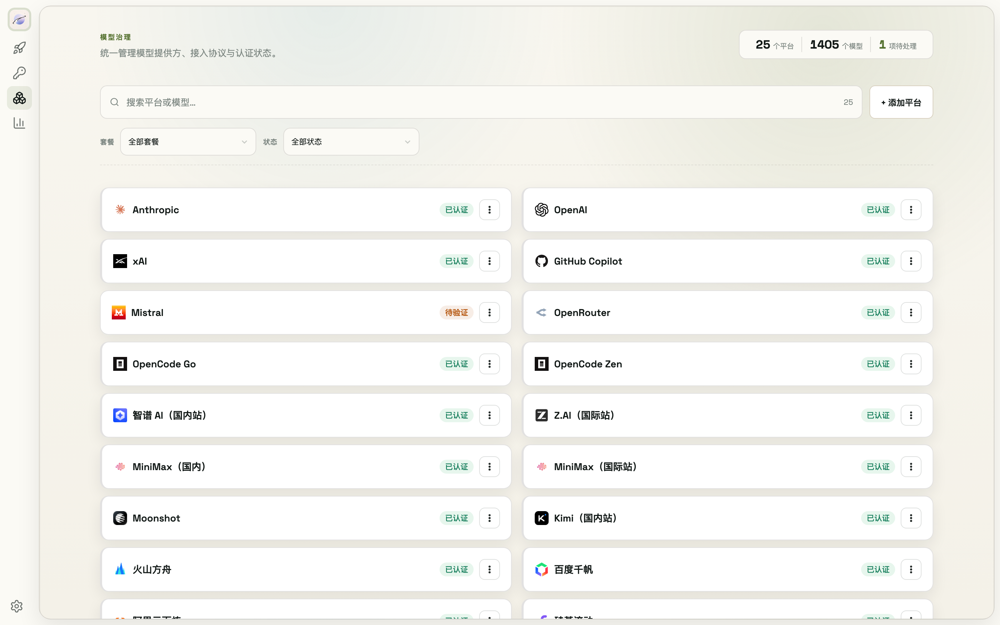

# 7. Model Providers



The Models page ships 41 provider presets (official APIs, aggregators, Chinese and global cloud platforms) and also supports adding custom platforms.

## 7.1 Browse & filter

- The search box at the top matches platform names and model names
- Filter by **plan** (Coding Plan / Token Plan / Go Plan / Agent subscription / API only) or by **status** (authenticated / needs setup / needs verification / needs review / in use)
- Every platform card carries an auth status badge — hover for details (OAuth vs API key auth, last review time, …)

## 7.2 Configure a platform

Open a platform's edit form (custom platforms start from **+ Add platform**):

- **Endpoints**: configure several; each row is a protocol type (anthropic / openai / responses) + Base URL. Custom platforms can switch an openai endpoint between chat / responses under "Advanced protocol settings"
- **Auth**: an API key (picked from the **vault**, can create one on the spot) or no auth (only for local services, public endpoints, or trusted internal gateways). Agent-native platforms like Claude subscriptions take no endpoint — they use **OAuth login** instead
- **Model list**: auto-filled after a successful connection test; you can also add/remove rows manually (each row is the `model` parameter used in requests)
- The form header links to the platform's official API docs and console

## 7.3 Connection test & model refresh

- After picking a key in the form, click **Test connection**: each endpoint is verified, and once all pass the platform's **model list is fetched automatically** into the form
- Platform card **⋯ menu**:
  - **API key connect / Sync models**: verify auth → sync the model list
  - **OAuth login** (supported platforms): triggers the CLI login flow; models sync automatically on success
  - **Settings** (edit) and **Delete**

## 7.4 Command line

```bash
modelswap provider list              # list all providers (--json for scripts)
modelswap provider add               # add
modelswap provider delete <name>     # delete
modelswap provider auth              # auth status of all providers
```
