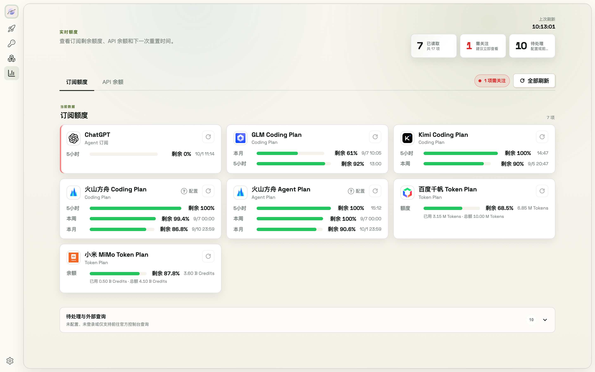

# 8. Usage & Alerts

The Usage page covers 37 subscription/balance sources — see what's left without opening each platform's console.

## 8.1 Page overview

- Two tabs: **Subscriptions** (remaining percentage and reset time per 5h / weekly / monthly window) and **API balances** (prepaid balance, flagged red when running low)
- Overview cards up top: how many sources have been read, "needs attention" (alert count), and "pending" (unconfigured or console-only platforms)
- Unconfigured, not-logged-in, or console-only platforms are tucked into the "Pending & external" collapsible, each card linking to its official console

## 8.2 Refresh

- **Refresh all** in the toolbar pulls every platform concurrently; each card has its own refresh button too
- Auto-polling runs every 5 minutes by default, speeding up to once a minute when a window is about to reset
- A few platforms (e.g. OpenCode Go) are manual-refresh only

## 8.3 Alerts

- Subscription remaining ≤30% triggers a yellow alert, ≤10% red; API balance ≤ $1 alerts; a heads-up appears when a window is about to reset with quota left
- Red alerts fire a **desktop notification** (grant the permission when first asked; duplicates are deduplicated by platform + window so you don't get spammed)
- Alerts collect under "Needs attention" in the page header; click an entry to jump to its card

## 8.4 Set up query credentials

Balance-query platforms (Volcengine, Alibaba Cloud/Tongyi, Baidu Qianfan, Tencent Cloud) need **read-only** query credentials created in their cloud consoles: click "Configure" on the card for a step-by-step guide (create an IAM user → attach the read-only policy → paste the AK/SK). Credentials are stored in the vault as a composite key, and connectivity is tested automatically on save.

The Quick Start page also shows a today's-usage summary.
