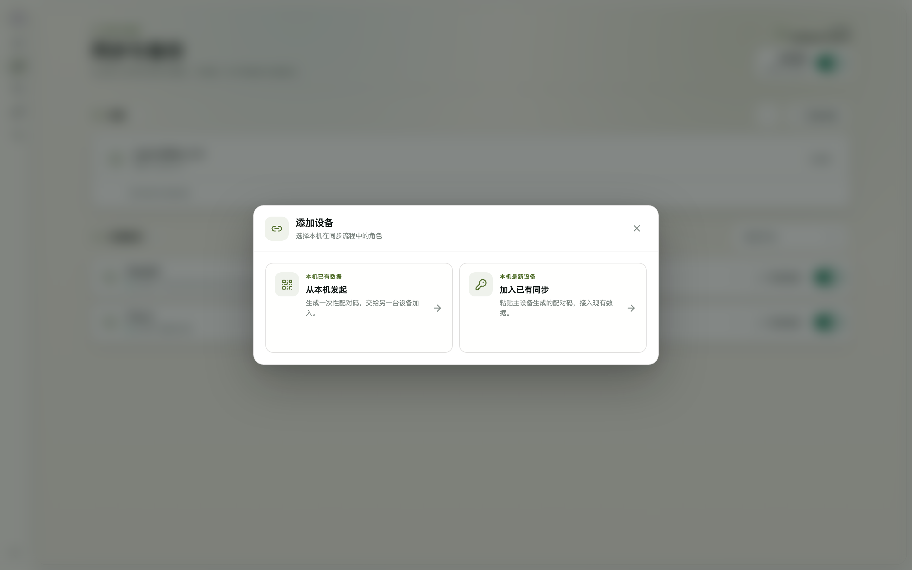

# 11. Multi-Device Sync

## 11.1 Cloud sync

End-to-end encrypted cross-machine sync. The cloud only ever sees ciphertext; the master key stays on your machine. All machines use the **same sync password**. Supported platforms: iCloud, WebDAV, Cloudflare (R2 / KV / D1 / Workers Secrets), Supabase, Volcengine.

Configure a platform and the sync password under **Settings → Cloud Backup**, then:

```bash
modelswap vault push                 # push keys + agent/provider configs to all enabled platforms
modelswap vault pull                 # pull the newest copy from each platform and merge
modelswap vault test cloudflare-kv   # test one platform's connection (e.g. supabase, cloudflare-kv)
```

## 11.2 Auto sync (recommended)

Turn on **Auto Sync** in settings and forget about manual push/pull:

- Local changes (keys, agent configs, provider configs) are **pushed automatically 10 seconds later**
- **All enabled platforms are pushed at once**, backing each other up; pulls always pick the newest copy across platforms
- Remotes are checked **every 5 minutes** and merged if newer (newest-wins by modification time — newer local changes are never overwritten by older data)
- On service start, ModelSwap merges remotes first, then pushes any unsent local changes
- The first enable pushes once immediately to establish a cloud baseline

## 11.3 LAN device sync

Sync directly between machines on the same LAN — no cloud account needed. Entry point: **Settings → Device Sync → Add device**.

> Prerequisites: both machines on the same LAN, using the **same sync password** (it is the root of the end-to-end encryption; if the primary machine has none yet, the dialog asks for one when you start).



**① Start from the machine that has the data (primary)**

1. **Settings → Device Sync** → click **Add device**
2. Choose **"Start from this machine"** (this machine already has data)
3. The dialog generates a one-time `modelswap-lan://` pairing code (expires after a short window) — copy it
4. Keep ModelSwap running on this machine; it notifies you automatically once the peer pairs

**② Join from the new machine**

1. Install and start ModelSwap on the new machine, go to **Settings → Device Sync → Add device**
2. Choose **"Join an existing sync"** (this machine is new)
3. Paste the pairing code, enter the **same sync password** as the primary, click **Connect**

**After pairing**

- The device list shows live online status; a LAN peer acts as a sync platform — manual `modelswap vault push` / `pull` and auto sync both include it
- Data is end-to-end encrypted; if the primary's IP changes (e.g. the router reassigns it), just re-pair once
- If the firewall blocks the first connection, allow inbound connections for ModelSwap (default port 3790)
- LAN and cloud sync can be enabled together as mutual backups; the **⋯** menu in the Device Sync section offers token reset and turning LAN sync off
