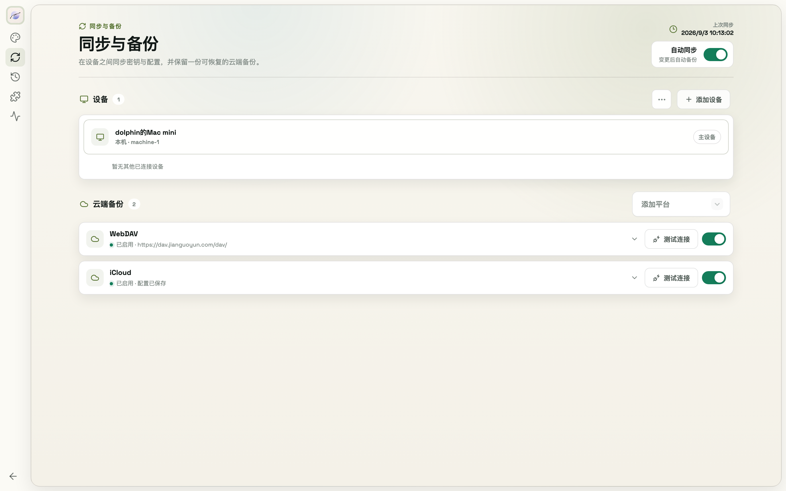

# 12. Settings Reference

| Section | Contents |
|---------|----------|
| Language & Appearance | UI language, light/dark mode, color scheme |
| Device Sync | LAN device status, device list, pairing entry |
| Cloud Backup | Sync platforms, sync password, auto sync toggle |
| Config History | Snapshots & restore (chapter 11) |
| About & Diagnostics | Local service health check, manual desktop update checks |
| Activity Log | Key/config operation log |

When the desktop app finds an update, it shows a download icon at the upper left of the window. Hover to read the release notes; after you download it, ModelSwap installs the update and relaunches automatically.
