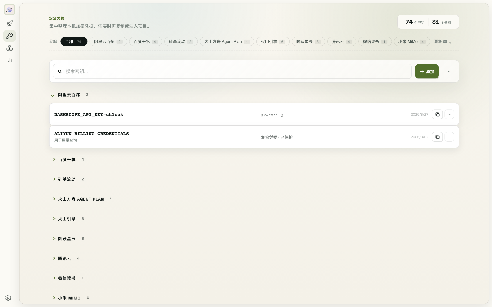

# 5. 密钥库日常使用



## 5.1 添加与查看

- **手动添加**：密钥管理 → 添加，填名称与 Key，可选填用途说明
- **查看**：密钥默认脱敏展示，需要时可查看完整值；密钥以 AES-256-GCM 加密存储在本机 `~/.modelswap`
- **命令行操作**：

```bash
modelswap vault list                  # 列出所有密钥（脱敏）
modelswap vault set <key>             # 交互式存密钥（推荐）
printf '%s' "$SECRET" | modelswap vault set <key> --stdin   # 自动化场景，避免密钥进入命令历史
modelswap vault get <key>             # 获取明文
modelswap vault delete <key>          # 删除
```

## 5.2 绑定项目（自动注入 .env）

密钥可以绑定到项目目录，ModelSwap 自动把 Key 写进该项目的 `.env`：

1. 在项目根目录创建 `.modelswapenv` 文件，写上需要的密钥名，如 `OPENAI_API_KEY`
2. 运行 `modelswap vault env`，ModelSwap 会根据 `.modelswapenv` 生成 `.env` 并登记关联
3. 之后用 `modelswap vault sync` 一键刷新所有关联文件（密钥更新后自动同步）

```bash
modelswap vault where <key>           # 查看某密钥被哪些项目使用
modelswap vault inject                # 输出 export 语句（配合 eval 使用）
modelswap vault inject --shell zsh    # 指定 shell 格式（bash/zsh/powershell）
```

## 5.3 cd 自动注入（可选）

```bash
modelswap hook install               # 安装 cd 钩子：进入项目目录自动 export 密钥
modelswap hook status                # 查看安装状态
modelswap hook uninstall             # 移除
```

> **Shell 配置安全边界**：安装和升级 ModelSwap **不会**修改你的 Shell 配置（`~/.zshrc` / `~/.bashrc` 等）。只有你主动运行 `modelswap hook install` 才会写入 cd 钩子，`modelswap hook uninstall` 可随时移除。
