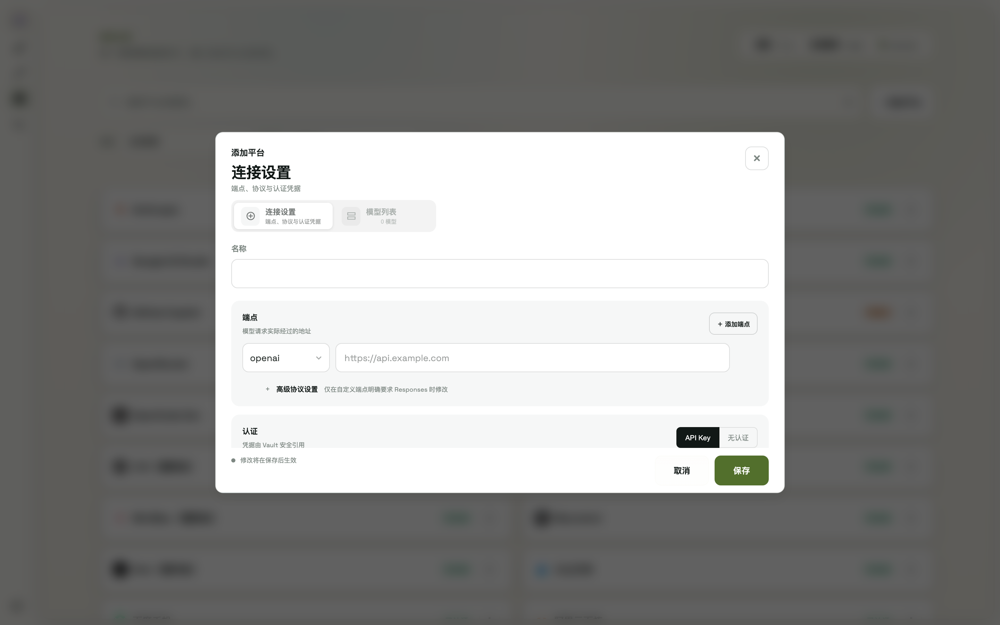

# 7. 模型平台（Provider）配置


模型管控页内置 41 个 Provider 预设（官方 API、聚合平台、国内外云厂商），也支持添加自定义平台。

## 7.1 浏览与筛选

- 顶部搜索框按平台名或模型名查找
- 按**套餐**筛选（Coding Plan / Token Plan / Go Plan / Agent 订阅 / 仅 API）或按**状态**筛选（已认证 / 待配置 / 待验证 / 需复核 / 被使用）
- 每张平台卡片带认证状态徽章，悬停可看详情（OAuth 或 API Key 认证、上次复核时间等）

## 7.2 配置一个平台

点开平台编辑表单（自定义平台走 **+ 添加平台**）：

- **端点**：可配置多个，每行选协议类型（anthropic / openai / responses）+ Base URL；自定义平台可在「高级协议设置」里把 openai 端点在 chat / responses 之间切换
- **认证**：API Key（从**密钥库**选择，可就地新建）或无认证（仅适用于本地服务、公开端点或可信内网网关）；Claude 订阅等 Agent 原生平台不填端点，改用 **OAuth 登录**
- **模型列表**：连接成功后自动回填，也可手动增删（每行即请求时的 `model` 参数名）
- 表单头部有该平台的官方接入文档与控制台外链



## 7.3 连接测试与模型刷新

- 表单内选好密钥后点**测试连接**：逐端点验证，全部通过后**自动拉取该平台的模型列表**回填表单
- 平台卡片 **⋯ 菜单**：
  - **API Key 连接 / 同步模型**：验证认证 → 自动同步模型列表
  - **OAuth 登录**（支持的平台）：触发 CLI 登录流程，成功后自动同步模型
  - **设置**（编辑）、**删除**

## 7.4 命令行

```bash
modelswap provider list              # 列出所有 Provider（--json 供脚本解析）
modelswap provider add               # 添加
modelswap provider delete <name>     # 删除
modelswap provider auth              # 查看所有 Provider 认证状态
```
