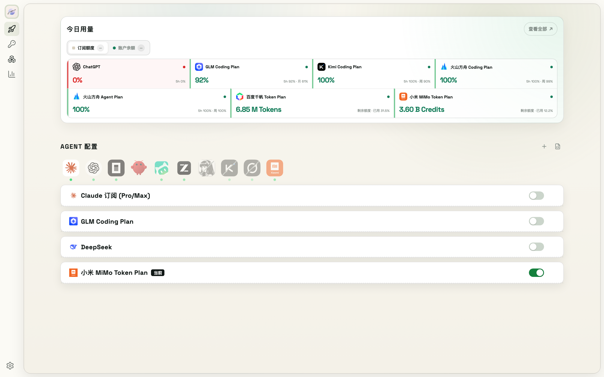

# 9. Agent 配置与模型切换



ModelSwap 适配 10 个 Agent：**Claude Code、ChatGPT (Codex)、Kimi Code、WorkBuddy、Hermes、OpenCode、OpenClaw、ZCode、Grok、MiMo Code**。入口在**快速启动**页的 Agent 配置区：顶部一排 Agent 标签，下方是该 Agent 的站点卡片列表。

## 9.1 两类 Agent

- **排他型（Claude Code、Codex）**：同一时刻只有一个站点生效，切换 = ModelSwap 改写该 Agent 的配置文件
- **叠加型（其余 8 个）**：多个站点同时写入 Agent 配置，站内切换由 Agent 自己完成

## 9.2 切换模型

1. 顶部点击 Agent 标签（未安装的 Agent 标签上有灰色小点；标签可拖拽排序）
2. 点击站点卡片展开模型列表
3. 点击模型 chip 即完成切换（当前模型高亮、不可再点）

配置文件（`settings.json`、`config.toml` 等）由 ModelSwap 自动写对，不需要手动编辑。

> **外科手术式写入**：只改 ModelSwap 管理的字段，你自己配置的 hooks、statusLine、MCP 等内容原样保留。每次切换前自动拍配置快照（见第 12 章），写入失败自动回滚。

## 9.3 添加站点

1. 点击区块标题右侧 **+ 添加站点**
2. 弹窗列出所有**已就绪**的 Provider（已在第 7 章配置并认证的平台），可搜索；勾选即选中
3. 进入模型选择：按名称/ID 搜索、多选模型（非编码模型带「非编程」标签，防止误配）；点 **刷新** 可从平台实时拉取最新模型列表
4. 点 **保存模型**——ModelSwap 校验路由与认证后写入 Agent 配置

## 9.4 查看 / 编辑配置文件

点击区块右上角 **查看配置**（文件图标）：

- 该 Agent 相关的每个配置文件一个标签页（如 Claude 的 `settings.json`、Codex 的 `config.toml` + `.env`）；标签上的圆点表示文件是否存在（绿=存在，红=不存在）
- 敏感值默认打码展示；点眼睛图标显示明文（需二次确认「周围无人、屏幕未共享」）
- 文件路径旁的眼睛按钮可切换**树形预览**（JSON 折叠视图），再点切回原文
- 支持直接编辑并保存：保存前自动校验语法并拍快照，出问题可回滚（见第 12 章）

## 9.5 站点管理

- **启停开关**：排他型关掉后自动回退官方默认配置；叠加型关掉会把该站点从 Agent 配置中移除（站点保留在列表里，随时可再开）
- **移除站点**：卡片右侧 ×；排他型移除当前站点会自动回退官方配置
- **移除模型**：chip 右侧小 ×（当前使用中的模型不可移除；删到 0 个站点会一并移除）
- **能力路由（Claude Code 专属）**：第三方站点卡片内有 HAIKU / SONNET / OPUS 三行映射，可指定各档位使用该站点的哪个模型（默认跟随主模型），避免 Claude Code 分层回退时请求到站点没有的模型

## 9.6 CLI 切换

```bash
modelswap provider switch            # 交互式切换（可指定 agent）
modelswap provider use <provider> --agent codex --model <model-id>   # 非交互式，脚本/CI 友好
modelswap provider current           # 查看所有 Agent 当前配置
```

## 9.7 其他说明

- **Codex 用户**：切换后 ModelSwap 会生成原生模型目录，可直接在 Codex CLI 里用 `/model` 切换，不必回到 ModelSwap
