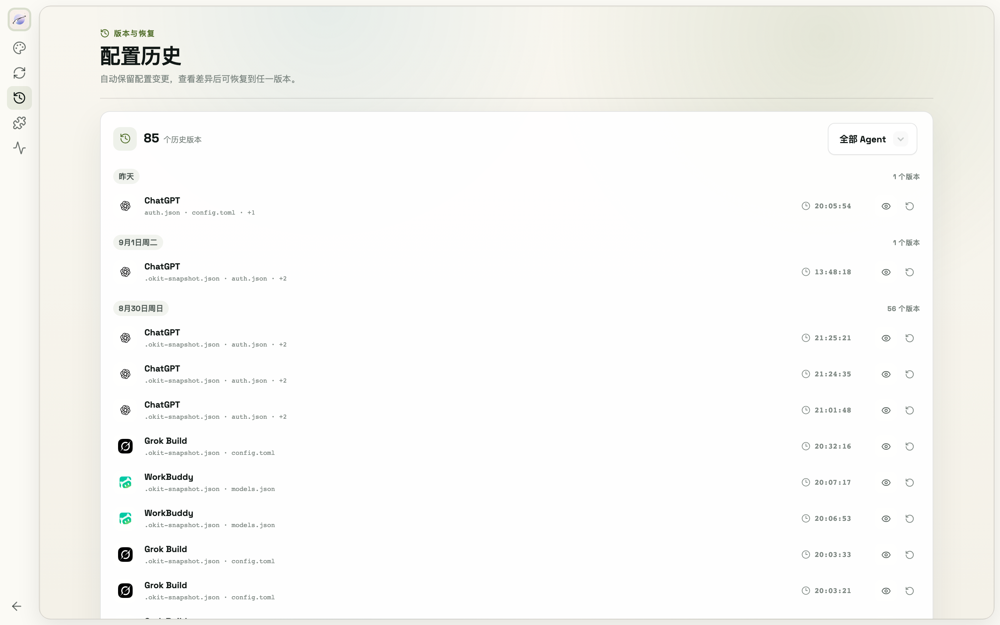

# 12. 配置快照与恢复

ModelSwap 在**每次切换 Provider / 模型、保存站点、手动编辑并保存配置文件**之前，都会自动拍一份配置快照。

1. 进入 **设置 → 配置历史**
2. 按 Agent 筛选（或查看全部），每条快照显示时间与涉及的文件
3. 点**查看**打开双栏对比（新增/删除行数统计，JSON 按键排序比对以过滤噪音），确认后一键**恢复**
4. 恢复操作本身也会先生成安全快照，可以再恢复回来

误切换、配置写坏、想回到上周的组合——都从这里找回来。
